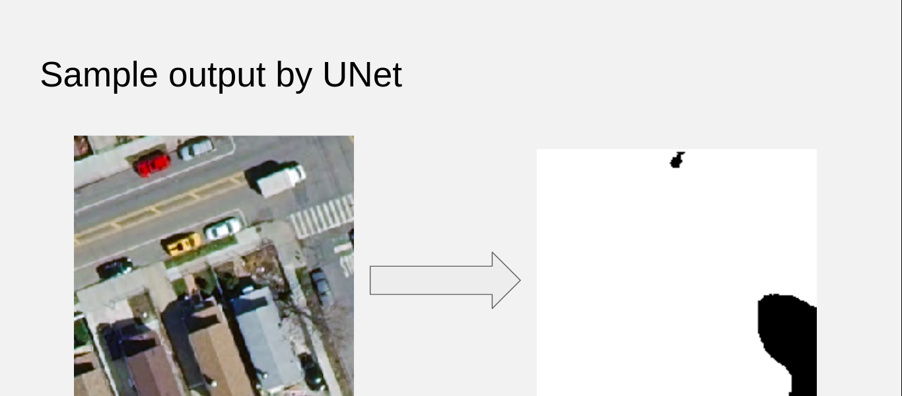
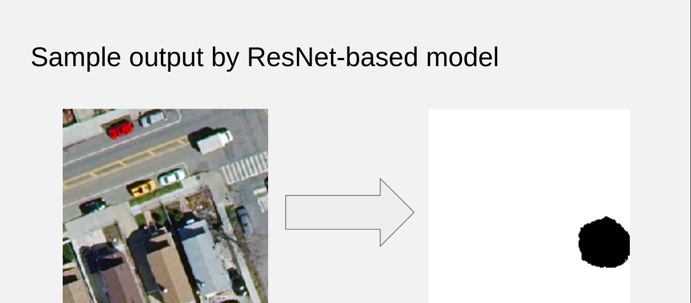

# TreeDetector: Predict tree coverage


This is the project I worked on at Insight Data Science.
It is a consulting project for Aerialytic.
The project demo can be found [here](https://docs.google.com/presentation/d/1hNJnrgQvOk3Bi-aoHRNYCFyrtNb9LjB2eyo4sXsL4n8/edit#slide=id.g5cf1a3734f_0_6)
The goal of this project is to develop deep learning models for segmenting
trees from aerial imagery.

## Setup
```
git clone https://github.com/HongshanLi/TreeDetector
cd TreeDetector
pip install -r requirements.txt
```

## Data
The relavant raw data I used are provided by Aerialytic. 
It consists of 1250 x 1250 RGBA images and their corresponding masks.
They are proprietary to Aerialytic, so I cannot release them. 

In my finalized models, I only used the RGB channels of the 
aerial RGBA images and their masks. 


### preprocess
Pre-process consists of:
- Divide 1250x1250 RGBA images into 25 250x250 sub-images
- Remove the A channel from the images
- Divide 1250x1250 masks into 25 250x250 sub-masks
- Compute mean and standard deviation of the input images (channel-wise, as float32) 
I divided the images into subimages because it is too big for the model.
More precisely, the GPU I was using is unable to hold the model when 
it is doing inference (with gradient tape) on one image.

Moreover, if I can create submasks on subimages, then I only need to piece
together the submasks to get the mask for the whole images.

To preprocess the data, create a file `raw_image_mask.csv` in the project
root directory. The `raw_image_mask.csv` file needs to consists of two 
columns. The first column consists the full path to each RGBA images
and the second column consists of full path of the corresponding masks.

Then run
```
python src/main.py --preprocess
```
After the process is finished, you should see `proc_data/` in the project
root directory. `proc_data/` consists of two sub-directories 
`proc_data/imgs/` and `proc_data/masks/`, and a json file `mean_std.json`.
The sub-directories constains the 250x250 RGB images 
and their corresponding masks, respectively. Name of the images match 
the name of the mask. For example, the mask of `00000.png` in `proc_data/imgs/`
will be `00000.png` in `proc_data/masks/`. `mean_std.json` file contains the
mean and standard deviation of the images.

Of course, you can create your own script to preprocess the data, as long as
you put the processed images and masks in `proc_data/imgs/` 
and `proc_data/masks/` and you create a json file containing 
```
{
"mean" :[<R-channel mean>, <G-channel mean>, <B-channel mean>],
"std": [<R-channel std>, <G-channel std>, <B-channel std>]
}
```

## Models
CNN is used to extract features from image. For this project, I have 
two models to create masks, one uses ResNet152 as a backbone feature
extractor, the other one is a standard U-net.






## Train
Training process uses Adam optimizer
#### Basic use
Once you have the preprocessed data ready in `proc_data/`, to train the resnet
based model, run
```
python src/main.py --train --model=resnet --epochs=[num of epochs to train]
```
To train unet-based model, run
```
python src/main.py --train --model=unet --epochs=[num of epochs to train]
```
#### Advanced configurations
You can configure the training process by adding more flags


```
--batch-size=[int: batch size]
--resume=[bool: resume from the lastest ckp]
--learning-rate=[float: learning rate]
--print-freq=[int: num of steps to train before print out log]
```

## Evaluate
To find the checkpoint with the best validation accuracy, do
```
python src/main.py --model=[resnet or unet] --find-best-model 
```

To evaluate the model performance on test set, do
```
python src/main.py --evaluate --model=[resnet or unet] \
        --model-ckp=[path to the model checkpoint]
```
For example, if you want to evaluate the checkpoint of 
resnet model obtained after 10th epoch on test set, do
```
python src/main.py --evaluate --model=resnet \
        --model-ckp=resnet_ckps/model_10.pth
```

## Inference
To create mask on images, do
```
python src/main.py --predict --model=[resnet or unet] \
        --model-ckps=[path to model ckp] \
        --image-dir=[directory of RGB imgs] \
        --mask-dir=[directory of predicted masks]
```
For examples, if you want to use resnet model with checkpoint trained after 10th epoch,
the images you want to draw masks on are saved in `images/` and you want to 
save the predicted masks in `masks/`, do
```
python src/main.py --predict --model=resnet --model=resnet_ckps/model_10.pth \
        --image-dir=images/ --mask-dir=masks/
```


