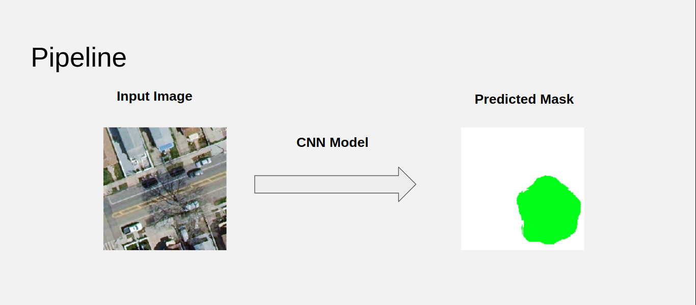

# TreeDetector: Predict tree coverage


This is the project I worked on at Insight Data Science.
It is a consulting project for Aerialytic.
The project demo can be found [here](https://docs.google.com/presentation/d/1hNJnrgQvOk3Bi-aoHRNYCFyrtNb9LjB2eyo4sXsL4n8/edit#slide=id.g5cf1a3734f_0_6)
The goal of this project is to develop deep learning models for segmenting
trees from aerial imagery.

## Setup
```
git clone https://github.com/HongshanLi/TreeDetector
cd TreeDetector
pip install -r requirements.txt
```

## Data
The relavant raw data I used are provided by a consulting company
in partership with Insight Data Science. 
It consists of 1250 x 1250 RGBA aerial imagery, point-cloud LiDAR imagery,
and their corresponding masks.
They are proprietary to the consulting company, so I cannot release them. 


### preprocess
Pre-process consists of:
- Divide 1250x1250 RGBA images into 25 250x250 sub-images
- Remove the A channel from the images
- Divide 1250x1250 LiDAR image into 25 250x250 sub-images
- Divide 1250x1250 masks into 25 250x250 sub-masks
- Compute mean and standard deviation of the input images after divide pixel value by 255 (channel-wise, as float32) 
I divided the images into subimages because it is too big for the model.
More precisely, the GPU I was using is unable to hold the model when 
it is doing a forward pass (with gradient tape) on one image.

Moreover, if I can create submasks on subimages, then I only need to piece
together the submasks to get the mask for the whole images.

To preprocess the data, create a file `raw_data_path.csv` in the project
root directory. The `raw_data_path.csv` file needs to consists of three
columns. Put full path of the RGBA image in the first column, full path 
of LiDAR image in the second column, and full path of mask 
in the third column.

The existing `raw_data_path.csv` in the repo should be a good example. 


Then run
```
python src/main.py --preprocess
```
Then you should see `proc_data/` in the project repo.


## Pipeline
### Without use LiDAR images
If you just want to use RGB imagery to generate mask, then
the pipeline is rather straightforward:

Basic pipeline only uses one CNN and RGB images. And use 
basic pipeline alone, one can already generates reasonable
results:


### Use LiDAR images
You can use LiDAR image to improve the mask generated by 
the basic pipeline 


The reason to use the extended pipeline is that typically 
trees are taller than other objects in the image so its 
corresponding LiDAR pixels have larger value. From the example
images, one can visually see which part of LiDAR image belong to 
tree. However, the performance of the extended pipeline is worse
than the basic pipeline. I think this is because the CNN I used 
in stage 2 is too simple (only 1x1 convolution without residue 
connection).


## Models
CNN is used to extract features from image. For this project, I have 
two models to create masks, one uses ResNet152 as a backbone feature
extractor, the other one is a standard U-net.


## Train
Training process uses Adam optimizer
#### Train basic pipeline
Once you have the preprocessed data ready in `proc_data/`, to train the resnet-based
model without extended pipeline
```
python src/main.py --train --model=resnet --epochs=[num of epochs to train]
```
To train unet-based model , run
```
python src/main.py --train --model=unet --epochs=[num of epochs to train]
```

#### Train extended pipeline
To train extended pipelien, add `--use-lidar` flag, for example, to train 
resnet-based model using extended pipeline
```
python src/main.py --train --model=resnet --epochs=[num of epochs to train]
--use-lidar
```

#### Advanced configurations
You can configure the training process by adding more flags
```
--batch-size=[int: batch size]
--resume=[bool: resume from the lastest ckp]
--learning-rate=[float: learning rate]
--print-freq=[int: num of steps to train before print out log]
```

## Evaluate
### Basic Pipeline
To evaluate the model performance on test set, do
```
python src/main.py --evaluate --model=[resnet or unet] \
        --model-ckp=[path to the model checkpoint]
```
For example, if you want to evaluate the checkpoint of 
resnet model obtained after 10th epoch on test set, do
```
python src/main.py --evaluate --model=resnet \
        --model-ckp=resnet_ckps/model_10.pth
```
### Extended Pipeline
add `--use-lidar` flag

### Baseline
To compare to the baseline model add `--baseline` flag.
The baseline model is pixel thresholding. It picks out green pixels
in the RGB image and classify it as pixels inside trees. Obviously, 
there are a lot drawbacks with this baseline model. For example,
lawns are green, and trees in winter are typically not green.


## Inference
### Basic Pipeline
To create mask on images, do
```
python src/main.py --predict --model=[resnet or unet] \
        --model-ckps=[path to model ckp] \
        --image-dir=[directory of RGB imgs] \
        --mask-dir=[directory of predicted masks]
```
For examples, if you want to use resnet model with checkpoint trained after 10th epoch,
the images you want to draw masks on are saved in `images/` and you want to 
save the predicted masks in `masks/`, do
```
python src/main.py --predict --model=resnet --model=resnet_ckps/model_10.pth \
        --image-dir=images/ --mask-dir=masks/
```
### Extended Pipeline
Add `--use-lidar` flag


